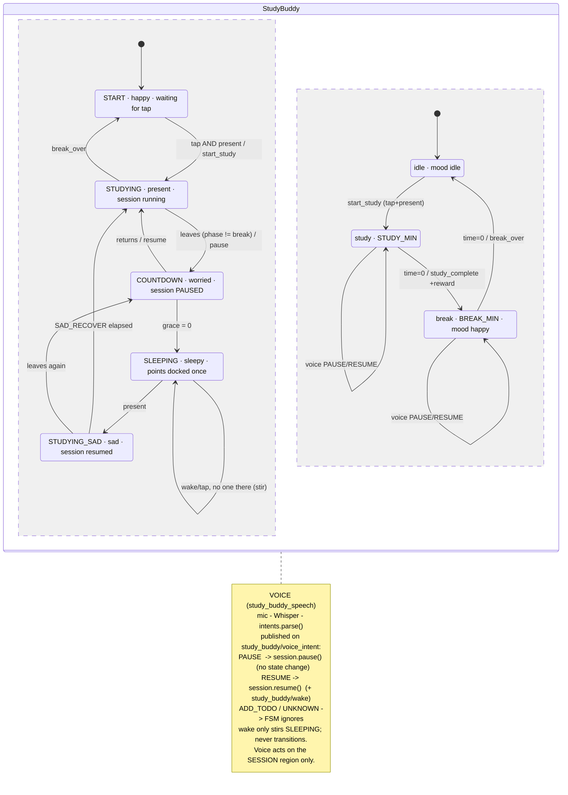

# Study-Buddy
Study buddy robot




setup.py will ship them on rebuild — glob('images/*.jpg') now also matches *_RZ.jpg, so they'll get installed into share/. Harmless (just duplicates), but if you'd rather not, you can exclude them — though that's optional and not worth bothering with unless it annoys you.
Neither affects functionality. The resized files persist across runs now, and the node only ever passes the mood images (happy.jpg/sad.jpg/neutral.jpg) into _resized_path, never the _RZ files, so there's no double-resize.
### Rebuild and check:
```bash
  cd ~/ros2_ws && colcon build --packages-select study_buddy_behavior && source install/setup.bash
  # T1
  ros2 run study_buddy_behavior expression
  # T2
  cd ~/ros2_ws && source install/setup.bash && ros2 topic pub --once study_buddy/mood std_msgs/msg/String "{data: happy}"
  # T3
  ls ~/ros2_ws/src/Study-Buddy/src/study_buddy_behavior/images/   # should show happy_RZ.jpg after first happy mood
```